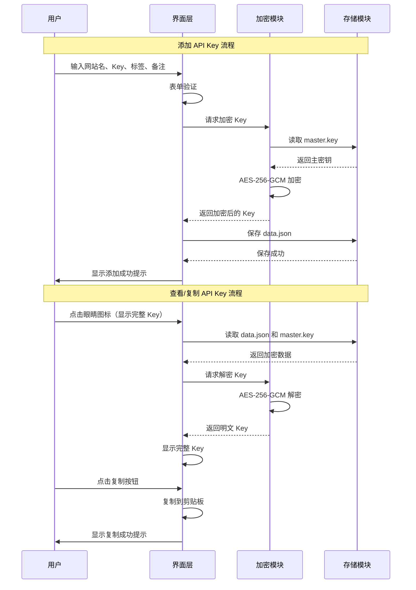
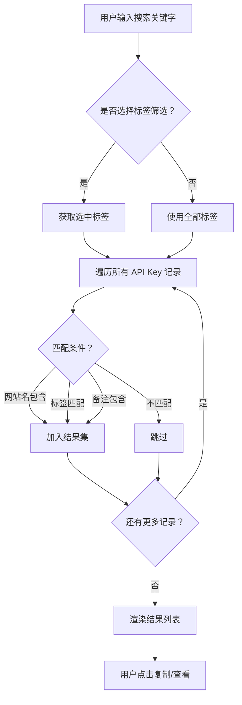

# API Key Manager - 产品需求文档 (PRD)

## 📋 目录

1. [版本记录](#版本记录)
2. [产品概述](#产品概述)
3. [用户画像](#用户画像)
4. [产品路线图](#产品路线图)
5. [MVP 功能规格](#mvp-功能规格)
6. [MVP 原型设计](#mvp-原型设计)
7. [架构设计](#架构设计)
8. [数据契约](#数据契约)
9. [技术选型](#技术选型)
10. [风险与应对](#风险与应对)

## 版本记录

**当前版本**: 1.0.2
**创建日期**: 2026-03-09
**当前版本状态**: 已完成

当你需要了解对应版本的开发功能和开发状态时，可以到版本文件列表对应目录下查找。

当需要完成新的功能时，请在 `./reference` 目录下创建对应版本号的.md文件，文件内容是对应的产品需求的更新内容,对应的ASCII原型图，以及涉及到的技术架构和要点更新。
版本文件中需要在头部包括整体功能说明，例子如下：
```markdown
#### 整体功能说明及进度

- [x] 导入功能增强：密钥重新加密与标签ID映射-已完成
- [ ] Key 显示/隐藏切换,30 秒自动隐藏-待完成
- [ ] 删除确认对话框-待完成
- [ ] 键盘快捷键-待完成
```

**注意**
不管你是需要完成新功能还是根据版本文件列表完成剩余功能，在具体的编码前，都需要再次检查按照此方开发后是否能完整实现需求，并且不影响其他不相关模块，如果有，请重新指定方案并和用户同步。

### 版本文件列表
[v1.0.2](./reference/v1.0.2.md)
[v1.0.1](./reference/v1.0.1.md)
[v1.0.0](./reference/v1.0.0.md)

---

## 产品概述

### 核心目标 (Mission)

打造一款现代、安全、易用的 Windows 桌面 API Key 管理工具，让用户告别手动翻找，一键复制各类 AI/MCP 网站的 API Key。

### 核心痛点

- API Key 只显示一次，忘记保存就需重新生成
- 多个网站的 Key 分散在浏览器书签、笔记、聊天纪录中
- 需要时找不到，找到了又要手动复制长长的字符串

---

## 用户画像 (Persona)

**目标用户**：开发者、AI 爱好者、技术从业者

**核心痛点**：
| 痛点场景 | 具体描述 |
|---------|---------|
| 丢失风险 | API Key 只显示一次，复制后忘记保存 |
| 分散存储 | Key 分散在浏览器书签、笔记、聊天纪录中 |
| 查找困难 | 需要时找不到，找到了又要手动复制长长的字符串 |
| 管理混乱 | 多个 Key 没有分类，无法快速定位 |

---

## 产品路线图

### V1: 最小可行产品 (MVP)

| 功能模块 | 功能描述 |
|---------|---------|
| **添加 API Key** | 手动输入：网站名称、Key 值（密码框隐藏）、标签（可多个）、备注 |
| **列表展示** | 双栏布局，左侧标签树，右侧列表显示网站名、标签、Key（脱敏） |
| **搜索筛选** | 搜索框支持网站名、标签关键字模糊匹配；点击标签可筛选 |
| **一键复制** | 列表项上有复制按钮，点击复制完整 Key 并提示成功 |
| **查看/编辑** | 眼睛图标切换显示完整 Key，支持编辑和删除 |
| **标签管理** | 自动记录使用过的标签，支持按标签筛选查看 |
| **本地存储** | JSON 文件 AES-256-GCM 加密存储，文件位置用户可见、可迁移 |
| **数据导入/导出** | 支持导出加密数据文件 + 密钥文件，可在另一台电脑导入 |

### V2 及以后版本 (Future Releases)

| 版本 | 功能 |
|-----|------|
| V2 | 布局切换：卡片网格 ↔ 双栏列表视图 |
| V2 | 主密码保护：启动时需输入密码解锁 |
| V2 | 过期时间提醒：为 Key 设置有效期，到期前提醒 |
| V3 | 云端同步：可选同步到云端备份 |
| V3 | 浏览器扩展：自动捕获网页上的 API Key |
| V4 | 使用统计：记录 Key 使用频率、最后复制时间 |
| V4 | 分类模板：预设常见 AI/MCP 网站分类模板 |

---

## MVP 功能规格

### 功能清单

#### 1. 添加 API Key
- 入口：右上角「➕ 添加」按钮
- 表单字段：
  - 网站名称（必填）
  - Key 值（必填，密码输入框）
  - 标签（可选，支持多个，逗号分隔或逐个添加）
  - 备注（可选）
- 提交后自动保存到加密存储

#### 2. 列表展示
- 默认显示所有 Key（脱敏格式）
- 每行显示：网站名 + 标签 + Key（脱敏）+ 眼睛图标 + 复制图标
- 支持点击眼睛图标切换完整显示/脱敏隐藏

#### 3. 搜索与筛选
- 顶部搜索框：支持网站名、标签、备注的模糊匹配
- 左侧标签树：点击标签快速筛选
- 「全部」选项：显示所有记录

#### 4. 复制功能
- 点击复制图标 → 复制完整 Key 到剪贴板
- 显示 Toast 提示「已复制」

#### 5. 编辑/删除
- 右键菜单或行内按钮：编辑、删除
- 编辑：打开弹窗，预填充原有数据
- 删除：二次确认弹窗

#### 6. 标签管理
- 自动收集所有使用过的标签
- 左侧标签树显示标签列表 + 数量
- 点击标签筛选，再次点击取消

#### 7. 数据导入/导出
- 导出：将 `data.json` + `master.key` 打包提示用户保存
- 导入：选择两个文件，验证后导入

---

## MVP 原型设计

### 双栏布局原型

```
┌─────────────────────────────────────────────────────────────────┐
│  🔑 API Key Manager                                    [➕ 添加] │
├──────────────┬──────────────────────────────────────────────────┤
│              │  🔍 搜索...                                      │
│  📂 全部     │  ─────────────────────────────────────────────── │
│  🏷️ AI      │  🌐 OpenAI         [AI][Chat]    sk-A1...y8  👁️ 📋 │
│  🏷️ MCP     │  ─────────────────────────────────────────────── │
│  🏷️ 支付     │  🌐 Anthropic      [AI][MCP]     sk-An...6w  👁️ 📋 │
│  🏷️ 邮箱     │  ─────────────────────────────────────────────── │
│  🏷️ 代码     │  🌐 GitHub         [代码]        ghp_...23  👁️ 📋 │
│  🏷️ 其他     │  ─────────────────────────────────────────────── │
│              │  🌐 Stripe         [支付]        sk_li...yz  👁️ 📋 │
│  ────────    │  ─────────────────────────────────────────────── │
│  + 新标签    │  🌐 SendGrid       [邮箱]        SG...56  👁️ 📋   │
│              │  ─────────────────────────────────────────────── │
└──────────────┴──────────────────────────────────────────────────┘
```

### 视觉风格：现代玻璃态 (Glassmorphism)

| 设计元素 | 规范 |
|---------|------|
| **背景** | 深色渐变背景 `#1a1a2e` → `#16213e` |
| **卡片/面板** | 半透明白色 `rgba(255,255,255,0.1)` + `backdrop-filter: blur(10px)` |
| **边框** | `1px solid rgba(255,255,255,0.2)` |
| **阴影** | 多层阴影营造悬浮感 |
| **文字** | 主文字 `#ffffff`，次要文字 `rgba(255,255,255,0.6)` |
| **强调色** | 蓝紫色渐变 `#667eea` → `#764ba2` |
| **图标** | Phosphor Icons |

---

## 架构设计

### 模块划分

| 模块名 | 文件路径 | 职责 |
|-------|---------|------|
| **主入口** | `main.go` | Wails 应用入口，窗口配置、生命周期管理 |
| **App 绑定** | `app.go` | 暴露给前端的 Go 方法，业务逻辑入口 |
| **加密模块** | `internal/crypto/crypto.go` | AES-256-GCM 加解密 |
| **存储模块** | `internal/storage/storage.go` | 文件读写、数据持久化、SHA-256 校验 |
| **模型定义** | `internal/models/models.go` | 数据结构定义 |
| **前端入口** | `frontend/index.html` | 应用 HTML 结构 |
| **前端逻辑** | `frontend/src/main.js` | UI 逻辑、状态管理、调用 Go 后端 |
| **样式文件** | `frontend/src/styles.css` | 玻璃态 UI 样式 |

### 核心流程图

#### 数据加密/解密流程



#### 搜索筛选流程



### Wails 绑定 API

| 方法名 | 参数 | 返回值 | 说明 |
|-------|------|--------|------|
| `LoadKeys` | 无 | `[]APIKeyRecord` | 加载所有 API Key |
| `AddKey` | `website, key string, tags []string, note string` | `APIKeyRecord` | 添加新 Key |
| `UpdateKey` | `id, website, key string, tags []string, note string` | `APIKeyRecord` | 更新 Key |
| `DeleteKey` | `id string` | `bool` | 删除 Key |
| `DecryptKey` | `id string` | `string` | 解密指定 Key（用于显示/复制） |
| `ExportData` | 无 | `ExportResult` | 导出数据文件 |
| `ImportData` | `dataPath, keyPath string` | `bool` | 导入数据文件 |
| `GetTags` | 无 | `[]TagInfo` | 获取所有标签及数量 |

---

## 数据契约

### API Key 记录结构

```typescript
interface APIKeyRecord {
  id: string;           // UUID
  website: string;      // 网站名称
  key: EncryptedData;   // 加密后的 Key
  tags: string[];       // 标签数组
  note: string;         // 备注（可选）
  createdAt: number;    // 创建时间戳
  updatedAt: number;    // 更新时间戳
}
```

### 加密数据结构

```typescript
interface EncryptedData {
  iv: string;           // 初始化向量（hex）
  authTag: string;      // GCM 认证标签（hex）
  encrypted: string;    // 加密数据（hex）
}
```

### 存储文件结构

```
data/
├── data.json           # 主数据文件
├── data.sha256         # 数据文件 SHA-256 校验和
├── master.key          # AES-256 主密钥（32 字节）
└── master.sha256       # 密钥文件 SHA-256 校验和
```

### data.json 格式

```json
{
  "version": "1.0",
  "items": [
    {
      "id": "550e8400-e29b-41d4-a716-446655440000",
      "website": "OpenAI",
      "key": {
        "iv": "a1b2c3d4e5f6g7h8i9j0k1l2",
        "authTag": "m3n4o5p6q7r8s9t0u1v2w3x4",
        "encrypted": "y5z6a7b8c9d0e1f2g3h4i5j6k7l8m9n0"
      },
      "tags": ["AI", "Chat"],
      "note": "主要用于聊天机器人项目",
      "createdAt": 1709107200000,
      "updatedAt": 1709107200000
    }
  ]
}
```

---

## 技术选型

| 技术领域 | 选型 | 理由 |
|---------|------|------|
| **应用框架** | Wails v2.11.0 | 轻量打包 (~10-20MB)、使用系统 WebView、内存占用低、Go 后端性能优异 |
| **后端语言** | Go 1.26.0 | 编译为原生代码、并发安全、标准库丰富、跨平台编译便捷 |
| **前端框架** | 原生 JavaScript + CSS | MVP 简单直接，无需额外框架开销 |
| **UI 组件** | 手写样式 (玻璃态) | 完全可控、体积最小、与设计风格统一 |
| **加密算法** | Go `crypto/aes` + `crypto/cipher` | 标准库 AES-256-GCM，无需第三方依赖 |
| **密钥生成** | `crypto/rand` | 密码学安全随机数生成 |
| **数据校验** | SHA-256 校验和 | 检测文件损坏、数据篡改 |
| **UUID 生成** | `github.com/google/uuid` | Go 主流 UUID 库 |
| **图标库** | Phosphor Icons | 现代风格，与玻璃态匹配 |

### 技术架构对比

| 对比项 | Wails + Go (新方案) | Electron + Node.js (原方案) |
|-------|---------------------|----------------------------|
| 打包体积 | ~10-20 MB | ~150+ MB |
| 内存占用 | ~50-100 MB | ~200-400 MB |
| 启动速度 | 快 (原生 WebView) | 较慢 (Chromium 启动) |
| 后端性能 | Go 原生编译 | Node.js 运行时 |
| 学习曲线 | Go + Wails | JavaScript 全栈 |
| 跨平台 | Windows/macOS/Linux | Windows/macOS/Linux |

---

## 风险与应对

| 风险 | 影响 | 概率 | 应对措施 |
|-----|------|------|---------|
| **密钥丢失** | 用户删除 `master.key` 后所有数据无法恢复 | 中 | 首次启动时提示备份密钥文件；导出时强制包含密钥 |
| **文件损坏** | `data.json` 损坏导致数据丢失 | 低 | SHA-256 校验和检测；每次写入前先备份 |
| **内存泄露** | 明文 Key 在内存中停留过久 | 低 | 复制后尽快清除；不全局存储明文 |
| **IPC 注入** | 恶意代码通过前端调用窃取数据 | 低 | Wails 绑定白名单暴露 API；生产环境禁用 DevTools |
| **跨平台路径** | Windows/Unix 路径分隔符不同 | 低 | 使用 `path` 模块统一处理 |
| **加密性能** | 大量 Key 时加解密慢 | 低 | 按需解密；缓存已解密 Key（内存中） |

---

## 项目文件结构

```
api-key-manager/
├── main.go                    # Wails 应用入口
├── app.go                     # App 结构体，暴露给前端的方法
├── go.mod                     # Go 模块定义
├── go.sum                     # Go 依赖锁定
├── wails.json                 # Wails 配置文件
├── internal/
│   ├── crypto/
│   │   └── crypto.go          # AES-256-GCM 加解密模块
│   ├── storage/
│   │   └── storage.go         # 文件读写、数据持久化
│   └── models/
│       └── models.go          # 数据结构定义
├── frontend/
│   ├── index.html             # 主界面
│   ├── src/
│   │   ├── main.js            # 前端逻辑
│   │   └── styles.css         # 玻璃态样式
│   └── wailsjs/               # Wails 自动生成的前端绑定
├── build/                     # 构建输出目录
│   └── appicon.png            # 应用图标
├── data/                      # 数据目录（运行时创建）
│   ├── data.json              # 加密数据
│   ├── data.sha256            # 数据文件校验和
│   ├── master.key             # 主密钥
│   └── master.sha256          # 密钥文件校验和
└── resources/                 # 静态资源
    └── icon.png
```

---

## 附录

### 关键业务规则

1. **Key 脱敏显示**：列表中 Key 默认显示为 `sk-xxxx...xxxx` 形式（前 8 位 + 省略号 + 后 4 位）
2. **加密存储**：使用 AES-256-GCM 加密，密钥存储在 `master.key` 文件
3. **搜索逻辑**：支持网站名、标签、备注的模糊匹配，不区分大小写
4. **标签格式**：标签为纯文本，多个标签用逗号分隔或逐个添加
5. **数据文件**：存储在 `./data/` 目录，用户可手动迁移
6. **文件校验**：每次读取时验证 SHA-256 校验和，损坏时提示用户

### 关键代码示例

#### 加密模块 (`internal/crypto/crypto.go`)

```go
package crypto

import (
	"crypto/aes"
	"crypto/cipher"
	"crypto/rand"
	"encoding/hex"
	"errors"
	"io"
)

const (
	KeyLength = 32 // 256 bits
	IVLength  = 12 // GCM 推荐 IV 长度
)

type EncryptedData struct {
	IV        string `json:"iv"`
	AuthTag   string `json:"authTag"`
	Encrypted string `json:"encrypted"`
}

// GenerateMasterKey 生成主密钥
func GenerateMasterKey() ([]byte, error) {
	key := make([]byte, KeyLength)
	_, err := rand.Read(key)
	return key, err
}

// Encrypt 加密数据
func Encrypt(plaintext string, masterKey []byte) (*EncryptedData, error) {
	block, err := aes.NewCipher(masterKey)
	if err != nil {
		return nil, err
	}

	gcm, err := cipher.NewGCM(block)
	if err != nil {
		return nil, err
	}

	iv := make([]byte, gcm.NonceSize())
	if _, err := io.ReadFull(rand.Reader, iv); err != nil {
		return nil, err
	}

	ciphertext := gcm.Seal(nil, iv, []byte(plaintext), nil)

	// GCM Seal 返回 ciphertext + authTag，需要分离
	authTagLen := 16 // GCM auth tag 固定 16 字节
	authTag := ciphertext[len(ciphertext)-authTagLen:]
	encrypted := ciphertext[:len(ciphertext)-authTagLen]

	return &EncryptedData{
		IV:        hex.EncodeToString(iv),
		AuthTag:   hex.EncodeToString(authTag),
		Encrypted: hex.EncodeToString(encrypted),
	}, nil
}

// Decrypt 解密数据
func Decrypt(data *EncryptedData, masterKey []byte) (string, error) {
	block, err := aes.NewCipher(masterKey)
	if err != nil {
		return "", err
	}

	gcm, err := cipher.NewGCM(block)
	if err != nil {
		return "", err
	}

	iv, _ := hex.DecodeString(data.IV)
	authTag, _ := hex.DecodeString(data.AuthTag)
	encrypted, _ := hex.DecodeString(data.Encrypted)

	// 重组 ciphertext + authTag
	ciphertext := append(encrypted, authTag...)

	plaintext, err := gcm.Open(nil, iv, ciphertext, nil)
	if err != nil {
		return "", errors.New("解密失败：密钥不匹配或数据损坏")
	}

	return string(plaintext), nil
}
```

#### 存储模块 (`internal/storage/storage.go`)

```go
package storage

import (
	"crypto/sha256"
	"encoding/hex"
	"encoding/json"
	"errors"
	"os"
	"path/filepath"
)

const (
	DataDir       = "data"
	DataFile      = "data.json"
	KeyFile       = "master.key"
	DataChecksum  = "data.sha256"
	KeyChecksum   = "master.sha256"
)

type DataFile struct {
	Version string          `json:"version"`
	Items   []APIKeyRecord  `json:"items"`
}

// GenerateChecksum 生成 SHA-256 校验和
func GenerateChecksum(data []byte) string {
	hash := sha256.Sum256(data)
	return hex.EncodeToString(hash[:])
}

// VerifyChecksum 验证校验和
func VerifyChecksum(filePath, checksumPath string) error {
	data, err := os.ReadFile(filePath)
	if err != nil {
		return err
	}

	storedChecksum, err := os.ReadFile(checksumPath)
	if err != nil {
		return err
	}

	computedChecksum := GenerateChecksum(data)
	if string(storedChecksum) != computedChecksum {
		return errors.New("文件校验失败，数据可能已损坏")
	}

	return nil
}

// InitStorage 初始化数据存储
func InitStorage() error {
	dataDir := filepath.Join(".", DataDir)
	if err := os.MkdirAll(dataDir, 0755); err != nil {
		return err
	}

	keyPath := filepath.Join(dataDir, KeyFile)
	if _, err := os.Stat(keyPath); os.IsNotExist(err) {
		masterKey, err := crypto.GenerateMasterKey()
		if err != nil {
			return err
		}

		if err := os.WriteFile(keyPath, masterKey, 0600); err != nil {
			return err
		}

		checksum := GenerateChecksum(masterKey)
		checksumPath := filepath.Join(dataDir, KeyChecksum)
		os.WriteFile(checksumPath, []byte(checksum), 0644)
	}

	dataPath := filepath.Join(dataDir, DataFile)
	if _, err := os.Stat(dataPath); os.IsNotExist(err) {
		emptyData := DataFile{Version: "1.0", Items: []APIKeyRecord{}}
		jsonData, _ := json.MarshalIndent(emptyData, "", "  ")

		if err := os.WriteFile(dataPath, jsonData, 0644); err != nil {
			return err
		}

		checksum := GenerateChecksum(jsonData)
		checksumPath := filepath.Join(dataDir, DataChecksum)
		os.WriteFile(checksumPath, []byte(checksum), 0644)
	}

	return nil
}

// ReadData 读取数据
func ReadData() (*DataFile, error) {
	dataDir := filepath.Join(".", DataDir)
	dataPath := filepath.Join(dataDir, DataFile)
	checksumPath := filepath.Join(dataDir, DataChecksum)

	if err := VerifyChecksum(dataPath, checksumPath); err != nil {
		return nil, err
	}

	data, err := os.ReadFile(dataPath)
	if err != nil {
		return nil, err
	}

	var result DataFile
	if err := json.Unmarshal(data, &result); err != nil {
		return nil, err
	}

	return &result, nil
}

// WriteData 写入数据
func WriteData(data *DataFile) error {
	dataDir := filepath.Join(".", DataDir)
	dataPath := filepath.Join(dataDir, DataFile)
	checksumPath := filepath.Join(dataDir, DataChecksum)

	// 先备份
	existing, err := os.ReadFile(dataPath)
	if err == nil {
		os.WriteFile(dataPath+".bak", existing, 0644)
	}

	jsonData, err := json.MarshalIndent(data, "", "  ")
	if err != nil {
		return err
	}

	if err := os.WriteFile(dataPath, jsonData, 0644); err != nil {
		return err
	}

	checksum := GenerateChecksum(jsonData)
	return os.WriteFile(checksumPath, []byte(checksum), 0644)
}

// ReadMasterKey 读取主密钥
func ReadMasterKey() ([]byte, error) {
	dataDir := filepath.Join(".", DataDir)
	keyPath := filepath.Join(dataDir, KeyFile)
	checksumPath := filepath.Join(dataDir, KeyChecksum)

	if err := VerifyChecksum(keyPath, checksumPath); err != nil {
		return nil, err
	}

	return os.ReadFile(keyPath)
}
```

---

**文档结束**
