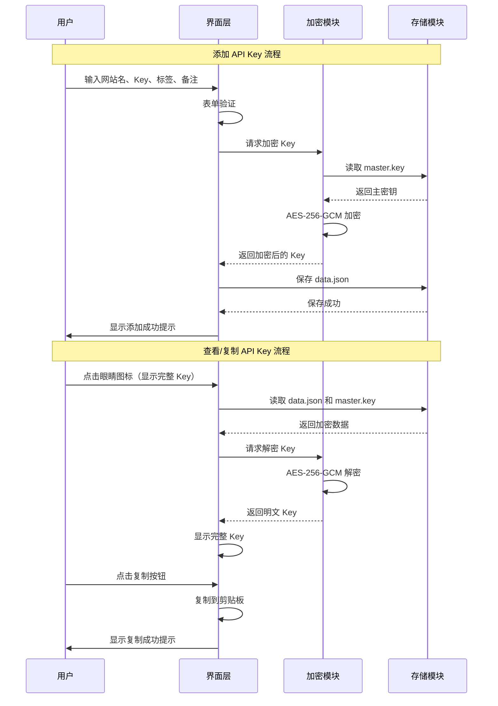
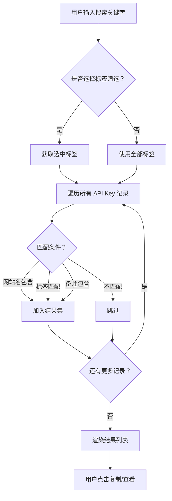

# API Key Manager - 产品需求文档 (PRD)

**版本**: 1.0.5
**创建日期**: 2026-02-28
**状态**: V1.0.0 已发布，V1.0.5 开发中

---

## 📝 版本更新记录

### V1.0.5 (2026-03-05) - 桌面端体验打磨

#### 1. Key 显示/隐藏切换

**需求**: 默认脱敏显示 API Key，点击眼睛图标可切换明文显示，提升安全性

**ASCII 原型图**:

```
┌─────────────────────────────────────────────────────────────────┐
│                    Key 显示/隐藏切换                              │
├─────────────────────────────────────────────────────────────────┤
│                                                                  │
│  【脱敏状态 - 默认】                                             │
│  ┌────────────────────────────────────────────────────────────┐ │
│  │  🌐 OpenAI          [AI][Chat]     sk-••••••••••••x8  👁️ 📋 │ │
│  │                                         ↑                   │ │
│  │                                    点击显示明文              │ │
│  └────────────────────────────────────────────────────────────┘ │
│                                                                  │
│  【明文状态 - 点击后】                                           │
│  ┌────────────────────────────────────────────────────────────┐ │
│  │  🌐 OpenAI          [AI][Chat]     sk-proj-ABC123xyz  👁️ 📋 │ │
│  │                                         ↑                   │ │
│  │                                    点击隐藏/30 秒自动隐藏     │ │
│  └────────────────────────────────────────────────────────────┘ │
│                                                                  │
└─────────────────────────────────────────────────────────────────┘
```

**技术方案**:

| 文件 | 变更类型 | 说明 |
|------|----------|------|
| `frontend/src/ui.js` | 修改 | `renderKeyList()` 添加眼睛图标切换逻辑 |
| `frontend/src/utils.js` | 新增 | `toggleKeyVisibility(keyElement)` 函数 |
| `frontend/styles/components.css` | 修改 | 添加 `.key-plaintext` 和 `.key-masked` 样式类 |

**技术要点**:
1. 默认状态：Key 显示为脱敏格式 `sk-••••••••••••x8`（前缀 + 中间圆点 + 后 4 位）
2. 点击眼睛图标后：显示完整明文 Key
3. 自动隐藏：明文显示 30 秒后自动恢复脱敏（可配置）
4. 状态同步：切换主题/刷新列表时保持当前状态

---

#### 2. 删除确认对话框

**需求**: 删除 API Key 时弹出确认对话框，防止误删

**ASCII 原型图**:

```
┌─────────────────────────────────────────────────────────────────┐
│                      删除确认对话框                              │
├─────────────────────────────────────────────────────────────────┤
│                                                                  │
│         ┌─────────────────────────────────────────────┐         │
│         │  ⚠️  确认删除                                │         │
│         │                                             │         │
│         │  确定要删除 "OpenAI" 的密钥吗？              │         │
│         │  此操作不可恢复。                           │         │
│         │                                             │         │
│         │  ┌─────────────┐  ┌─────────────┐          │         │
│         │  │   取消      │  │   删除      │          │         │
│         │  └─────────────┘  └─────────────┘          │         │
│         │     (Esc)           (Enter)                 │         │
│         └─────────────────────────────────────────────┘         │
│                                                                  │
└─────────────────────────────────────────────────────────────────┘
```

**技术方案**:

| 文件 | 变更类型 | 说明 |
|------|----------|------|
| `frontend/src/main.js` | 修改 | `deleteKey()` 添加确认对话框调用 |
| `frontend/src/ui.js` | 新增 | `showDeleteConfirm(website, onConfirm)` 函数 |
| `frontend/styles/components.css` | 修改 | 添加 `.confirm-dialog` 样式 |

**技术要点**:
1. 删除按钮点击后，不直接调用删除 API
2. 弹出确认对话框，显示网站名称
3. 用户确认后执行删除，取消则关闭
4. 支持键盘快捷键：Enter 确认，Esc 取消

---

#### 3. 空状态优化

**需求**: 无密钥或无搜索结果时显示友好的引导提示

**ASCII 原型图**:

```
┌─────────────────────────────────────────────────────────────────┐
│                        空状态设计                                │
├─────────────────────────────────────────────────────────────────┤
│                                                                  │
│  【首次使用 - 无密钥】                                           │
│  ┌────────────────────────────────────────────────────────────┐ │
│  │  ─────────────────────────────────────────────────────────  │ │
│  │                     🔐                                      │ │
│  │                   还没有密钥                                │ │
│  │                                                             │ │
│  │        添加您的第一个 API Key，开始安全管理                   │ │
│  │                                                             │ │
│  │              ┌─────────────────┐                           │ │
│  │              │  ➕ 添加第一个密钥  │                           │ │
│  │              └─────────────────┘                           │ │
│  │  ─────────────────────────────────────────────────────────  │ │
│  └────────────────────────────────────────────────────────────┘ │
│                                                                  │
│  【无搜索结果】                                                  │
│  ┌────────────────────────────────────────────────────────────┐ │
│  │  ─────────────────────────────────────────────────────────  │ │
│  │                     🔍                                      │ │
│  │                  未找到匹配的密钥                            │ │
│  │                                                             │ │
│  │        尝试其他关键词，或 [清除筛选]                         │ │
│  │  ─────────────────────────────────────────────────────────  │ │
│  └────────────────────────────────────────────────────────────┘ │
│                                                                  │
└─────────────────────────────────────────────────────────────────┘
```

**技术方案**:

| 文件 | 变更类型 | 说明 |
|------|----------|------|
| `frontend/src/ui.js` | 修改 | `renderKeyList()` 添加空状态判断 |
| `frontend/styles/components.css` | 新增 | `.empty-state` 样式类 |

---

#### 4. 键盘快捷键

**需求**: 添加常用操作的键盘快捷键，提升效率

**快捷键清单**:

| 快捷键 | 功能 | 说明 |
|--------|------|------|
| `Ctrl + N` | 新建密钥 | 打开添加密钥模态框 |
| `Ctrl + F` | 聚焦搜索框 | 快速开始搜索 |
| `Ctrl + Enter` | 保存 | 在模态框中保存 |
| `Esc` | 关闭模态框 | 取消操作 |
| `Delete` | 删除选中项 | 需先选中密钥 |
| `C` | 复制选中密钥 | 需先选中密钥 |

**技术方案**:

| 文件 | 变更类型 | 说明 |
|------|----------|------|
| `frontend/src/main.js` | 修改 | 添加全局键盘事件监听 |

---

**非相关模块（不受影响）**:
- ✅ 后端 Go 代码 (`app.go`, `internal/`)
- ✅ 标签管理 (`tags.js`)
- ✅ 导入/导出 (`import-export.js`)
- ✅ 主题切换 (`theme.js`)

---

### V1.0.4 (2026-03-02)

#### 1. Phosphor Icons 本地化

**需求**: 将图标库从 CDN 加载改为本地加载，解决网络超时导致图标无法显示的问题

**问题描述**:
- 启动应用时报 `cdn.jsdelivr.net ERR_CONNECTION_TIMED_OUT` 错误
- 所有 Phosphor Icons 图标无法显示
- 应用依赖网络才能正常使用图标

**ASCII 原型图**:

```
┌─────────────────────────────────────────────────────────────────┐
│                    架构变更对比                                  │
├─────────────────────────────────────────────────────────────────┤
│                                                                  │
│  【修改前 - CDN 加载】                                           │
│  ┌──────────────┐         网络请求              ┌──────────┐    │
│  │  Wails App   │ ───────────────────────────▶ │   CDN    │    │
│  │  (WebView2)  │   unpkg.com (超时风险)        │  (失败)  │    │
│  └──────────────┘                               └──────────┘    │
│         │                                                        │
│         │ 图标无法渲染 ❌                                         │
│         ▼                                                        │
│  ┌──────────────────────────────────────────────────────┐       │
│  │  index.html: <script src="https://unpkg.com/...">    │       │
│  └──────────────────────────────────────────────────────┘       │
│                                                                  │
├─────────────────────────────────────────────────────────────────┤
│                                                                  │
│  【修改后 - 本地加载】                                           │
│  ┌──────────────┐                                               │
│  │  Wails App   │  ✅ 零网络依赖                                 │
│  │  (WebView2)  │                                               │
│  └──────────────┘                                               │
│         │                                                        │
│         │ 本地文件读取                                           │
│         ▼                                                        │
│  ┌──────────────────────────────────────────────────────┐       │
│  │            frontend/public/phosphor-icons/            │       │
│  │  ┌────────────────────────────────────────────────┐  │       │
│  │  │  Phosphor.woff2       (147 KB) - Regular 字体   │  │       │
│  │  │  Phosphor-Bold.woff2  (150 KB) - Bold 字体      │  │       │
│  │  │  Phosphor-Fill.woff2  (131 KB) - Fill 字体      │  │       │
│  │  │  phosphor-icons.css   (250 KB) - 完整图标映射   │  │       │
│  │  └────────────────────────────────────────────────┘  │       │
│  └──────────────────────────────────────────────────────┘       │
│         │                                                        │
│         │ CSS 引用                                               │
│         ▼                                                        │
│  ┌──────────────────────────────────────────────────────┐       │
│  │  index.html: <link rel="stylesheet" href="./public/  │       │
│  │               phosphor-icons/phosphor-icons.css">    │       │
│  └──────────────────────────────────────────────────────┘       │
│                                                                  │
└─────────────────────────────────────────────────────────────────┘
```

**技术方案**:

| 文件 | 变更类型 | 说明 |
|------|----------|------|
| `frontend/public/phosphor-icons/Phosphor.woff2` | 新增 | Regular 字体文件 (147 KB) |
| `frontend/public/phosphor-icons/Phosphor-Bold.woff2` | 新增 | Bold 字体文件 (150 KB) |
| `frontend/public/phosphor-icons/Phosphor-Fill.woff2` | 新增 | Fill 字体文件 (131 KB) |
| `frontend/public/phosphor-icons/phosphor-icons.css` | 新增 | 完整官方 CSS 映射文件 (250 KB) |
| `frontend/index.html` | 修改 | CDN script 标签替换为本地 CSS link |

**图标映射验证 (项目使用的 49 个图标)**:

```
┌─────────────────────────────────────────────────────────────────┐
│                     图标使用清单                                 │
├──────────────────┬──────────────────────────────────────────────┤
│    图标类名       │                   用途                        │
├──────────────────┼──────────────────────────────────────────────┤
│ ph-key           │ ✅ 标题、API Key 卡片                         │
│ ph-moon          │ ✅ 主题切换（暗色模式）                        │
│ ph-sun           │ ✅ 主题切换（亮色模式）                        │
│ ph-plus          │ ✅ 添加按钮、创建标签                          │
│ ph-magnifying-glass │ ✅ 搜索框                               │
│ ph-x             │ ✅ 关闭弹窗                                   │
│ ph-tag           │ ✅ 标签相关                                   │
│ ph-folders       │ ✅ 标签树图标                                 │
│ ph-eye           │ ✅ 显示密码                                   │
│ ph-eye-slash     │ ✅ 隐藏密码                                   │
│ ph-copy          │ ✅ 复制按钮                                   │
│ ph-pencil        │ ✅ 编辑按钮                                   │
│ ph-trash         │ ✅ 删除按钮                                   │
│ ph-check-circle  │ ✅ 成功提示                                   │
│ ph-x-circle      │ ✅ 错误提示                                   │
│ ph-warning       │ ✅ 警告提示                                   │
│ ph-info          │ ✅ 信息提示                                   │
│ ph-download-simple │ ✅ 导出按钮                                 │
│ ph-upload-simple │ ✅ 导入按钮                                   │
│ ph-gear          │ ✅ 管理标签                                   │
│ ph-arrow-counter-clockwise │ ✅ 恢复按钮                        │
│ ph-fill ph-chat-centered │ ✅ OpenAI 品牌                      │
│ ph-fill ph-sparkle │ ✅ Anthropic 品牌                          │
│ ph-fill ph-github-logo │ ✅ GitHub 品牌                        │
│ ph-fill ph-google-logo │ ✅ Google 品牌                        │
│ ph-fill ph-microsoft-logo │ ✅ Microsoft/Azure 品牌            │
│ ph-fill ph-cloud │ ✅ AWS/Cloudflare 品牌                       │
│ ph-fill ph-credit-card │ ✅ Stripe 品牌                        │
│ ph-fill ph-envelope │ ✅ SendGrid 品牌                         │
│ ph-fill ph-vector-three │ ✅ Vercel 品牌                       │
│ ph-fill ph-globe │ ✅ Netlify 品牌                              │
│ ph-fill ph-hard-drives │ ✅ DigitalOcean 品牌                  │
│ ph-fill ph-cloud-arrow-up │ ✅ Heroku 品牌                     │
│ ph-fill ph-gitlab-logo │ ✅ GitLab 品牌                        │
│ ph-fill ph-chats-circle │ ✅ Slack 品牌                        │
│ ph-fill ph-discord-logo │ ✅ Discord 品牌                      │
│ ph-fill ph-twitter-logo │ ✅ Twitter 品牌                      │
│ ph-fill ph-notebook │ ✅ Notion 品牌                           │
│ ph-fill ph-figma-logo │ ✅ Figma 品牌                          │
└──────────────────┴──────────────────────────────────────────────┘
```

**技术要点**:

1. **官方 CSS 文件**: 直接使用 Phosphor Icons v2.1.1 官方 CSS，包含完整的 `:before` 伪元素 + Unicode content 映射

2. **三种字体变体**:
   - `Phosphor` (Regular): 默认样式，类名 `.ph`
   - `Phosphor-Bold`: 粗体样式，类名 `.ph-bold`
   - `Phosphor-Fill`: 填充样式，类名 `.ph-fill`

3. **字体路径**: CSS 中使用相对路径 `./Phosphor.woff2`，与字体文件同目录

4. **Ligatures 支持**: CSS 启用 `font-feature-settings: "liga"` 支持连字特性

**非相关模块（不受影响）**:
- ✅ 所有业务逻辑文件 (`main.js`, `tags.js`, `import-export.js`, `ui.js`, `theme.js`)
- ✅ 图标类名使用方式完全不变 (`<i class="ph ph-key"></i>`)
- ✅ 样式文件 (`styles/*.css`)
- ✅ 后端 Go 代码

---

### V1.0.3 (2026-03-01)

#### 1. 导入功能修复

**需求**: 修复导入功能的多项问题，包括文件选择、冲突解决流程

**问题描述**:
- 点击导入按钮后，无法获取文件路径（WebView2 兼容性问题）
- 点击确认导入后无反应，控制台无报错
- 取消导入后再次选择文件无法正常导入

**ASCII 原型图**:

```
┌─────────────────────────────────────────────────────────────────┐
│                        修复后的导入流程                            │
├─────────────────────────────────────────────────────────────────┤
│                                                                  │
│  用户点击"导入"按钮                                               │
│         │                                                        │
│         ▼                                                        │
│  ┌──────────────────────────────────┐                           │
│  │ OpenImportFileDialog()           │  ← Wails 原生文件对话框    │
│  │ 打开 Windows 文件选择对话框       │                           │
│  │ 过滤 *.zip 文件                   │                           │
│  └────────┬─────────────────────────┘                           │
│           │ 返回文件路径                                          │
│           ▼                                                      │
│  ┌──────────────────────────────────┐                           │
│  │ ImportData(filePath)             │  ← 检测冲突               │
│  │ 返回 hasConflicts, conflicts     │                           │
│  └────────┬─────────────────────────┘                           │
│           │                                                      │
│      ┌────┴────┐                                                │
│      │ 有冲突   │ 无冲突                                          │
│      ▼         ▼                                                 │
│  ┌─────────┐  ┌──────────────────┐                              │
│  │ 返回    │  │ 直接导入         │                              │
│  │ Promise │  │ showImportResult │                              │
│  │ 并等待  │  └──────────────────┘                              │
│  │ 用户确认│                                                 │
│  └─────────┘                                                 │
│                                                                  │
└─────────────────────────────────────────────────────────────────┘
```

**技术方案**:

| 文件 | 变更内容 |
|------|----------|
| `app.go` | 新增 `OpenImportFileDialog()` 方法，使用 `runtime.OpenFileDialog` 打开原生文件对话框 |
| `frontend/src/import-export.js` | 修改 `openImportDialog()` 使用 Go 端方法；修复 `openConflictResolveDialog()` 返回 Promise；添加防重复点击保护 |
| `frontend/wailsjs/go/main/App.js` | 添加 `OpenImportFileDialog` JS 绑定 |
| `frontend/wailsjs/go/main/App.d.ts` | 添加 TypeScript 类型定义 |

**技术要点**:

1. **Wails 原生文件对话框**: 使用 `runtime.OpenFileDialog` 替代 HTML File API，解决 WebView2 环境下 `file.path` 不可用的问题

2. **Promise 链正确处理**: `openConflictResolveDialog` 返回 Promise，在用户确认/取消时 resolve，让主流程能正确等待

3. **死锁修复**: `ImportWithResolution` 直接解压文件而不调用 `ImportData`（后者会尝试获取同一把锁，导致死锁）

4. **备份目录递归修复**: `copyDir` 函数跳过 `backup` 和 `export` 目录，避免无限递归

5. **防重复点击**: 确认导入按钮添加 `disabled` 状态和 `isImporting` 标志

**非相关模块（不受影响）**:
- ✅ 导出功能 (`openExportDialog`)
- ✅ 标签管理 (`tags.js`)
- ✅ 主题切换 (`theme.js`)
- ✅ 主界面逻辑 (`main.js`)
- ✅ 状态管理 (`state.js`)

---

### V1.0.2 (2026-03-01)

#### 1. 主题切换功能

**需求**: 添加浅色主题样式，并支持在界面右上角进行主题切换

**修改内容**:
- 新增浅色主题 CSS 变量配置
- 在 Logo 右侧添加主题切换按钮（太阳/月亮图标）
- 主题偏好保存到 localStorage，持久化用户选择

**ASCII 原型图**:

```
┌─────────────────────────────────────────────────────────────────┐
│ 🔑 API Key Manager              🌙                    [➕ 添加] │
├──────────────┬──────────────────────────────────────────────────┤
│              │  🔍 搜索...                                      │
│  📂 全部     │  ─────────────────────────────────────────────── │
│  🏷️ AI      │  🌐 OpenAI         [AI][Chat]    sk-A1...y8  👁️ │
│  🏷️ MCP     │  ─────────────────────────────────────────────── │
│  🏷️ 支付     │  🌐 Anthropic      [AI][MCP]     sk-An...6w  👁️ │
│              │                                                  │
│  + 新标签    │                                                  │
└──────────────┴──────────────────────────────────────────────────┘

切换后浅色主题:
┌─────────────────────────────────────────────────────────────────┐
│ 🔑 API Key Manager              ☀️                    [➕ 添加] │
├──────────────┬──────────────────────────────────────────────────┤
│              │  🔍 搜索...                                      │
│  📂 全部     │  ─────────────────────────────────────────────── │
│  🏷️ AI      │  🌐 OpenAI         [AI][Chat]    sk-A1...y8  👁️ │
│  🏷️ MCP     │  ─────────────────────────────────────────────── │
│  🏷️ 支付     │  🌐 Anthropic      [AI][MCP]     sk-An...6w  👁️ │
│              │                                                  │
│  + 新标签    │                                                  │
└──────────────┴──────────────────────────────────────────────────┘

主题切换按钮特写:
┌─────────────────────────────────────────────────────────────────┐
│ [Logo] API Key Manager    ◐    [添加 +]                       │
│                         ↑↑↑                                     │
│              切换按钮位置（Logo右侧，添加按钮左侧）            │
└─────────────────────────────────────────────────────────────────┘
```

**技术方案**:

| 文件 | 变更内容 |
|------|----------|
| `frontend/styles/variables.css` | 添加 `[data-theme="light"]` 浅色主题 CSS 变量 |
| `frontend/styles/variables.css` | 添加滚动条主题变量 |
| `frontend/styles/components.css` | 添加 `.theme-toggle` 按钮样式 |
| `frontend/index.html` | 添加主题切换按钮 HTML |
| `frontend/src/theme.js` | 新建主题管理模块（init/toggle/applyTheme） |

**浅色主题变量对照**:

| 变量 | 暗色主题 | 浅色主题 |
|------|----------|----------|
| `--bg-gradient-start` | `#1a1a2e` | `#f5f7fa` |
| `--bg-gradient-end` | `#16213e` | `#e4e8ec` |
| `--glass-bg` | `rgba(255,255,255,0.1)` | `rgba(255,255,255,0.85)` |
| `--glass-border` | `rgba(255,255,255,0.2)` | `rgba(0,0,0,0.1)` |
| `--text-primary` | `#ffffff` | `#1a1a2e` |
| `--scrollbar-track` | `rgba(255,255,255,0.05)` | `rgba(0,0,0,0.05)` |
| `--scrollbar-thumb` | `rgba(255,255,255,0.2)` | `rgba(0,0,0,0.2)` |

**技术要点**:
- 使用 `data-theme` 属性在 `<html>` 标签上切换主题
- 主题偏好使用 `localStorage` 持久化，页面刷新后保持用户选择
- 暗色主题为默认主题
- 切换按钮图标根据当前主题动态切换（月亮=暗色，太阳=浅色）
- 仅修改前端样式文件，不涉及后端 Go 代码

**非相关模块（不受影响）**:
- ✅ 后端 Go 代码 (`app.go`, `internal/`)
- ✅ API 绑定 (`src/api.js`)
- ✅ 状态管理 (`src/state.js`)
- ✅ 业务逻辑 (`src/utils.js`)
- ✅ Toast 组件逻辑
- ✅ 模态框组件逻辑

---

### V1.0.1 (2026-03-01)

#### 1. UI 美化优化

**问题**: 原 UI 样式与 PRD 原型设计存在差异

**修改内容**:
- 调整玻璃态面板透明度: `0.08` → `0.1`
- 调整玻璃模糊: `12px` → `10px`
- 调整边框透明度: `0.15` → `0.2`
- 调整次要文字透明度: `0.7` → `0.6`
- 增强阴影效果，添加多层悬浮感

**文件变更**:
| 文件 | 变更 |
|------|------|
| `frontend/styles/variables.css` | CSS 变量调整 |
| `frontend/styles/components.css` | 列表样式重构为分隔线风格 |
| `frontend/styles/animations.css` | 新增动画效果 |

#### 2. 模态框居中修复

**问题**: 添加 API Key 的弹框显示在左上角，而非屏幕中央

**原因**:
- `<dialog>` 元素缺少居中定位样式
- 内部 `<div class="modal">` 与外层类名冲突

**修改内容**:
```
修复前:
┌─────────────────────────────────────────────────────────┐
│  🔑 API Key Manager                            [➕ 添加] │
├──────────────┬──────────────────────────────────────────┤
│              │                                           │
│   侧边栏     │         添加 API Key ← 偏左上角          │
│              │                                           │
└──────────────┴──────────────────────────────────────────┘

修复后:
┌─────────────────────────────────────────────────────────┐
│  🔑 API Key Manager                            [➕ 添加] │
├──────────────┬──────────────────────────────────────────┤
│              │                                           │
│   侧边栏     │            添加 API Key ← 居中显示       │
│              │                                           │
└──────────────┴──────────────────────────────────────────┘
```

**技术方案**:
- 为 `dialog.modal` 添加 `position: fixed; top: 50%; left: 50%; transform: translate(-50%, -50%)`
- 分离内部容器类名: `.modal` → `.modal-content`

**文件变更**:
| 文件 | 变更 |
|------|------|
| `frontend/styles/components.css` | 添加 `dialog.modal` 居中样式 + `.modal-content` 新类 |
| `frontend/src/main.js` | 内部 div 类名改为 `modal-content` |

#### 3. 网站图标智能匹配

**问题**: 列表中网站显示统一使用 Globe 图标

**修改内容**:
- 为常见网站添加专属图标映射 (OpenAI、Anthropic、GitHub、Stripe 等 20+ 网站)
- 列表项添加入场动画效果

**文件变更**:
| 文件 | 变更 |
|------|------|
| `frontend/src/main.js` | 添加 `websiteIcons` 映射表 + `getWebsiteIcon()` 函数 |

---


## 📋 目录

1. [产品概述](#产品概述)
2. [用户画像](#用户画像)
3. [产品路线图](#产品路线图)
4. [MVP 功能规格](#mvp-功能规格)
5. [MVP 原型设计](#mvp-原型设计)
6. [架构设计](#架构设计)
7. [数据契约](#数据契约)
8. [技术选型](#技术选型)
9. [风险与应对](#风险与应对)

---

## 产品概述

### 核心目标 (Mission)

打造一款现代、安全、易用的 Windows 桌面 API Key 管理工具，让用户告别手动翻找，一键复制各类 AI/MCP 网站的 API Key。

### 核心痛点

- API Key 只显示一次，忘记保存就需重新生成
- 多个网站的 Key 分散在浏览器书签、笔记、聊天纪录中
- 需要时找不到，找到了又要手动复制长长的字符串

---

## 用户画像 (Persona)

**目标用户**：开发者、AI 爱好者、技术从业者

**核心痛点**：
| 痛点场景 | 具体描述 |
|---------|---------|
| 丢失风险 | API Key 只显示一次，复制后忘记保存 |
| 分散存储 | Key 分散在浏览器书签、笔记、聊天纪录中 |
| 查找困难 | 需要时找不到，找到了又要手动复制长长的字符串 |
| 管理混乱 | 多个 Key 没有分类，无法快速定位 |

---

## 产品路线图

### V1.0.0 - V1.0.4: 已完成功能

| 版本 | 日期 | 功能模块 | 功能描述 |
|------|------|----------|----------|
| **V1.0.0** | 2026-02-28 | 基础版本 | 首次 GitHub 发布版本 |
| **V1.0.1** | 2026-03-01 | UI 美化 | 玻璃态样式优化、模态框居中修复、网站图标智能匹配 |
| **V1.0.2** | 2026-03-01 | 主题切换 | 浅色/深色主题切换，localStorage 持久化 |
| **V1.0.3** | 2026-03-02 | 导入修复 | 修复导入功能文件选择、冲突解决流程 |
| **V1.0.4** | 2026-03-02 | 图标本地化 | Phosphor Icons 本地加载，移除 CDN 依赖 |

### V1.0.5: MVP+ 增强版（当前开发中）

> **策略**: 打磨桌面端核心体验，为 V2 云同步做准备

| 功能模块 | 功能描述 | 优先级 | 状态 |
|----------|----------|--------|------|
| **Key 显示/隐藏切换** | 默认脱敏显示，点击眼睛图标切换明文，30 秒自动隐藏 | P0 | 待开发 |
| **删除确认对话框** | 删除前二次确认，防止误删 | P0 | 待开发 |
| **空状态优化** | 无密钥/无搜索结果时的友好引导 | P1 | 待开发 |
| **键盘快捷键** | Ctrl+N 新建、Ctrl+F 搜索、Esc 关闭等 | P2 | 待开发 |

### V2 及以后版本 (Future Releases)

| 版本 | 功能 | 说明 |
|------|------|------|
| V2 | 云同步 | 端到端加密同步，多设备共享 |
| V2 | 主密码保护 | 启动时需输入密码解锁 |
| V2 | macOS 支持 | 正式支持 Mac 平台 |
| V3 | 移动端 App | iOS/Android 支持 |
| V3 | 浏览器扩展 | Chrome/Safari 插件，快速填充 API Key |
| V4 | 密钥轮换提醒 | 检测密钥有效期，提前提醒 |
| V4 | 使用统计 | 记录 Key 使用频率、最后复制时间 |

---

## MVP 功能规格

### 功能清单

#### 1. 添加 API Key
- 入口：右上角「➕ 添加」按钮
- 表单字段：
  - 网站名称（必填）
  - Key 值（必填，密码输入框）
  - 标签（可选，支持多个，逗号分隔或逐个添加）
  - 备注（可选）
- 提交后自动保存到加密存储

#### 2. 列表展示
- 默认显示所有 Key（脱敏格式）
- 每行显示：网站名 + 标签 + Key（脱敏）+ 眼睛图标 + 复制图标
- 支持点击眼睛图标切换完整显示/脱敏隐藏

#### 3. 搜索与筛选
- 顶部搜索框：支持网站名、标签、备注的模糊匹配
- 左侧标签树：点击标签快速筛选
- 「全部」选项：显示所有记录

#### 4. 复制功能
- 点击复制图标 → 复制完整 Key 到剪贴板
- 显示 Toast 提示「已复制」

#### 5. 编辑/删除
- 右键菜单或行内按钮：编辑、删除
- 编辑：打开弹窗，预填充原有数据
- 删除：二次确认弹窗

#### 6. 标签管理
- 自动收集所有使用过的标签
- 左侧标签树显示标签列表 + 数量
- 点击标签筛选，再次点击取消

#### 7. 数据导入/导出
- 导出：将 `data.json` + `master.key` 打包提示用户保存
- 导入：选择两个文件，验证后导入

---

## MVP 原型设计

### 原型 A：简洁列表式（已选定）

```
┌─────────────────────────────────────────────────────────────────┐
│  🔐 API Key Manager                               🌙  [+ 新建]  │
├─────────────────────────────────────────────────────────────────┤
│  [🔍 搜索密钥...]  [筛选：全部 ▼]                               │
├──────────────┬──────────────────────────────────────────────────┤
│              │                                                  │
│  📁 标签库   │   🔑 AI 服务 (12)                                │
│              │   ┌────────────────────────────────────────────┐ │
│  • 🧠 AI     │   │ OpenAI         sk-•••••••••••••••  [👁][📋] │ │
│  • 🔌 MCP    │   │ Anthropic      sk-ant-••••••••••••  [👁][📋] │ │
│  • 💳 支付   │   │ Midjourney     mj-••••••••••••••••  [👁][📋] │ │
│  • 📧 邮箱   │   │ Stability      st-••••••••••••••••  [👁][📋] │ │
│  • 💻 代码   │   └────────────────────────────────────────────┘ │
│  • ☁️ 云服务 │                                                  │
│  • 👥 社交   │   🔑 支付网关 (5)                                │
│  • 🏷️ 其他   │   ┌────────────────────────────────────────────┐ │
│              │   │ Stripe         sk_live_••••••••••••  [👁][📋] │ │
│  [+ 管理标签]│   │ PayPal         ••••••••••••••••••  [👁][📋] │ │
│              │   └────────────────────────────────────────────┘ │
│              │                                                  │
│              │   [➕ 添加密钥]  [⚙️ 设置]                       │
└──────────────┴──────────────────────────────────────────────────┘
```

**设计理念**:
- 左侧固定标签导航，右侧卡片式列表
- 每条密钥一行，关键信息一目了然
- 快速操作按钮（查看/复制）直接外露

**设计说明**:
1. 左侧固定标签导航栏，支持快速筛选
2. 右侧按标签分组展示密钥列表
3. 每条密钥显示：网站名 + 脱敏 Key + [查看][复制] 按钮
4. 查看按钮 (👁)：切换明文/脱敏显示
5. 复制按钮 (📋)：一键复制到剪贴板
6. 底部固定操作栏：添加密钥、设置

### 视觉风格：现代玻璃态 (Glassmorphism)

| 设计元素 | 规范 |
|---------|------|
| **背景** | 深色渐变背景 `#1a1a2e` → `#16213e` |
| **卡片/面板** | 半透明白色 `rgba(255,255,255,0.1)` + `backdrop-filter: blur(10px)` |
| **边框** | `1px solid rgba(255,255,255,0.2)` |
| **阴影** | 多层阴影营造悬浮感 |
| **文字** | 主文字 `#ffffff`，次要文字 `rgba(255,255,255,0.6)` |
| **强调色** | 蓝紫色渐变 `#667eea` → `#764ba2` |
| **图标** | Phosphor Icons |

---

## 架构设计

### 模块划分

| 模块名 | 文件路径 | 职责 |
|-------|---------|------|
| **主入口** | `main.go` | Wails 应用入口，窗口配置、生命周期管理 |
| **App 绑定** | `app.go` | 暴露给前端的 Go 方法，业务逻辑入口 |
| **加密模块** | `internal/crypto/crypto.go` | AES-256-GCM 加解密 |
| **存储模块** | `internal/storage/storage.go` | 文件读写、数据持久化、SHA-256 校验 |
| **模型定义** | `internal/models/models.go` | 数据结构定义 |
| **前端入口** | `frontend/index.html` | 应用 HTML 结构 |
| **前端逻辑** | `frontend/src/main.js` | UI 逻辑、状态管理、调用 Go 后端 |
| **样式文件** | `frontend/src/styles.css` | 玻璃态 UI 样式 |

### 核心流程图

#### 数据加密/解密流程



#### 搜索筛选流程



### Wails 绑定 API

| 方法名 | 参数 | 返回值 | 说明 |
|-------|------|--------|------|
| `LoadKeys` | 无 | `[]APIKeyRecord` | 加载所有 API Key |
| `AddKey` | `website, key string, tags []string, note string` | `APIKeyRecord` | 添加新 Key |
| `UpdateKey` | `id, website, key string, tags []string, note string` | `APIKeyRecord` | 更新 Key |
| `DeleteKey` | `id string` | `bool` | 删除 Key |
| `DecryptKey` | `id string` | `string` | 解密指定 Key（用于显示/复制） |
| `ExportData` | 无 | `ExportResult` | 导出数据文件 |
| `ImportData` | `dataPath, keyPath string` | `bool` | 导入数据文件 |
| `GetTags` | 无 | `[]TagInfo` | 获取所有标签及数量 |

---

## 数据契约

### API Key 记录结构

```typescript
interface APIKeyRecord {
  id: string;           // UUID
  website: string;      // 网站名称
  key: EncryptedData;   // 加密后的 Key
  tags: string[];       // 标签数组
  note: string;         // 备注（可选）
  createdAt: number;    // 创建时间戳
  updatedAt: number;    // 更新时间戳
}
```

### 加密数据结构

```typescript
interface EncryptedData {
  iv: string;           // 初始化向量（hex）
  authTag: string;      // GCM 认证标签（hex）
  encrypted: string;    // 加密数据（hex）
}
```

### 存储文件结构

```
data/
├── data.json           # 主数据文件
├── data.sha256         # 数据文件 SHA-256 校验和
├── master.key          # AES-256 主密钥（32 字节）
└── master.sha256       # 密钥文件 SHA-256 校验和
```

### data.json 格式

```json
{
  "version": "1.0",
  "items": [
    {
      "id": "550e8400-e29b-41d4-a716-446655440000",
      "website": "OpenAI",
      "key": {
        "iv": "a1b2c3d4e5f6g7h8i9j0k1l2",
        "authTag": "m3n4o5p6q7r8s9t0u1v2w3x4",
        "encrypted": "y5z6a7b8c9d0e1f2g3h4i5j6k7l8m9n0"
      },
      "tags": ["AI", "Chat"],
      "note": "主要用于聊天机器人项目",
      "createdAt": 1709107200000,
      "updatedAt": 1709107200000
    }
  ]
}
```

---

## 技术选型

| 技术领域 | 选型 | 理由 |
|---------|------|------|
| **应用框架** | Wails v2.11.0 | 轻量打包 (~10-20MB)、使用系统 WebView、内存占用低、Go 后端性能优异 |
| **后端语言** | Go 1.26.0 | 编译为原生代码、并发安全、标准库丰富、跨平台编译便捷 |
| **前端框架** | 原生 JavaScript + CSS | MVP 简单直接，无需额外框架开销 |
| **UI 组件** | 手写样式 (玻璃态) | 完全可控、体积最小、与设计风格统一 |
| **加密算法** | Go `crypto/aes` + `crypto/cipher` | 标准库 AES-256-GCM，无需第三方依赖 |
| **密钥生成** | `crypto/rand` | 密码学安全随机数生成 |
| **数据校验** | SHA-256 校验和 | 检测文件损坏、数据篡改 |
| **UUID 生成** | `github.com/google/uuid` | Go 主流 UUID 库 |
| **图标库** | Phosphor Icons | 现代风格，与玻璃态匹配 |

### 技术架构对比

| 对比项 | Wails + Go (新方案) | Electron + Node.js (原方案) |
|-------|---------------------|----------------------------|
| 打包体积 | ~10-20 MB | ~150+ MB |
| 内存占用 | ~50-100 MB | ~200-400 MB |
| 启动速度 | 快 (原生 WebView) | 较慢 (Chromium 启动) |
| 后端性能 | Go 原生编译 | Node.js 运行时 |
| 学习曲线 | Go + Wails | JavaScript 全栈 |
| 跨平台 | Windows/macOS/Linux | Windows/macOS/Linux |

---

## 风险与应对

| 风险 | 影响 | 概率 | 应对措施 |
|-----|------|------|---------|
| **密钥丢失** | 用户删除 `master.key` 后所有数据无法恢复 | 中 | 首次启动时提示备份密钥文件；导出时强制包含密钥 |
| **文件损坏** | `data.json` 损坏导致数据丢失 | 低 | SHA-256 校验和检测；每次写入前先备份 |
| **内存泄露** | 明文 Key 在内存中停留过久 | 低 | 复制后尽快清除；不全局存储明文 |
| **IPC 注入** | 恶意代码通过前端调用窃取数据 | 低 | Wails 绑定白名单暴露 API；生产环境禁用 DevTools |
| **跨平台路径** | Windows/Unix 路径分隔符不同 | 低 | 使用 `path` 模块统一处理 |
| **加密性能** | 大量 Key 时加解密慢 | 低 | 按需解密；缓存已解密 Key（内存中） |

---

## 项目文件结构

```
api-key-manager/
├── main.go                    # Wails 应用入口
├── app.go                     # App 结构体，暴露给前端的方法
├── go.mod                     # Go 模块定义
├── go.sum                     # Go 依赖锁定
├── wails.json                 # Wails 配置文件
├── internal/
│   ├── crypto/
│   │   └── crypto.go          # AES-256-GCM 加解密模块
│   ├── storage/
│   │   └── storage.go         # 文件读写、数据持久化
│   └── models/
│       └── models.go          # 数据结构定义
├── frontend/
│   ├── index.html             # 主界面
│   ├── src/
│   │   ├── main.js            # 前端逻辑
│   │   └── styles.css         # 玻璃态样式
│   └── wailsjs/               # Wails 自动生成的前端绑定
├── build/                     # 构建输出目录
│   └── appicon.png            # 应用图标
├── data/                      # 数据目录（运行时创建）
│   ├── data.json              # 加密数据
│   ├── data.sha256            # 数据文件校验和
│   ├── master.key             # 主密钥
│   └── master.sha256          # 密钥文件校验和
└── resources/                 # 静态资源
    └── icon.png
```

---

## 附录

### 关键业务规则

1. **Key 脱敏显示**：列表中 Key 默认显示为 `sk-xxxx...xxxx` 形式（前 8 位 + 省略号 + 后 4 位）
2. **加密存储**：使用 AES-256-GCM 加密，密钥存储在 `master.key` 文件
3. **搜索逻辑**：支持网站名、标签、备注的模糊匹配，不区分大小写
4. **标签格式**：标签为纯文本，多个标签用逗号分隔或逐个添加
5. **数据文件**：存储在 `./data/` 目录，用户可手动迁移
6. **文件校验**：每次读取时验证 SHA-256 校验和，损坏时提示用户

### 关键代码示例

#### 加密模块 (`internal/crypto/crypto.go`)

```go
package crypto

import (
	"crypto/aes"
	"crypto/cipher"
	"crypto/rand"
	"encoding/hex"
	"errors"
	"io"
)

const (
	KeyLength = 32 // 256 bits
	IVLength  = 12 // GCM 推荐 IV 长度
)

type EncryptedData struct {
	IV        string `json:"iv"`
	AuthTag   string `json:"authTag"`
	Encrypted string `json:"encrypted"`
}

// GenerateMasterKey 生成主密钥
func GenerateMasterKey() ([]byte, error) {
	key := make([]byte, KeyLength)
	_, err := rand.Read(key)
	return key, err
}

// Encrypt 加密数据
func Encrypt(plaintext string, masterKey []byte) (*EncryptedData, error) {
	block, err := aes.NewCipher(masterKey)
	if err != nil {
		return nil, err
	}

	gcm, err := cipher.NewGCM(block)
	if err != nil {
		return nil, err
	}

	iv := make([]byte, gcm.NonceSize())
	if _, err := io.ReadFull(rand.Reader, iv); err != nil {
		return nil, err
	}

	ciphertext := gcm.Seal(nil, iv, []byte(plaintext), nil)

	// GCM Seal 返回 ciphertext + authTag，需要分离
	authTagLen := 16 // GCM auth tag 固定 16 字节
	authTag := ciphertext[len(ciphertext)-authTagLen:]
	encrypted := ciphertext[:len(ciphertext)-authTagLen]

	return &EncryptedData{
		IV:        hex.EncodeToString(iv),
		AuthTag:   hex.EncodeToString(authTag),
		Encrypted: hex.EncodeToString(encrypted),
	}, nil
}

// Decrypt 解密数据
func Decrypt(data *EncryptedData, masterKey []byte) (string, error) {
	block, err := aes.NewCipher(masterKey)
	if err != nil {
		return "", err
	}

	gcm, err := cipher.NewGCM(block)
	if err != nil {
		return "", err
	}

	iv, _ := hex.DecodeString(data.IV)
	authTag, _ := hex.DecodeString(data.AuthTag)
	encrypted, _ := hex.DecodeString(data.Encrypted)

	// 重组 ciphertext + authTag
	ciphertext := append(encrypted, authTag...)

	plaintext, err := gcm.Open(nil, iv, ciphertext, nil)
	if err != nil {
		return "", errors.New("解密失败：密钥不匹配或数据损坏")
	}

	return string(plaintext), nil
}
```

#### 存储模块 (`internal/storage/storage.go`)

```go
package storage

import (
	"crypto/sha256"
	"encoding/hex"
	"encoding/json"
	"errors"
	"os"
	"path/filepath"
)

const (
	DataDir       = "data"
	DataFile      = "data.json"
	KeyFile       = "master.key"
	DataChecksum  = "data.sha256"
	KeyChecksum   = "master.sha256"
)

type DataFile struct {
	Version string          `json:"version"`
	Items   []APIKeyRecord  `json:"items"`
}

// GenerateChecksum 生成 SHA-256 校验和
func GenerateChecksum(data []byte) string {
	hash := sha256.Sum256(data)
	return hex.EncodeToString(hash[:])
}

// VerifyChecksum 验证校验和
func VerifyChecksum(filePath, checksumPath string) error {
	data, err := os.ReadFile(filePath)
	if err != nil {
		return err
	}

	storedChecksum, err := os.ReadFile(checksumPath)
	if err != nil {
		return err
	}

	computedChecksum := GenerateChecksum(data)
	if string(storedChecksum) != computedChecksum {
		return errors.New("文件校验失败，数据可能已损坏")
	}

	return nil
}

// InitStorage 初始化数据存储
func InitStorage() error {
	dataDir := filepath.Join(".", DataDir)
	if err := os.MkdirAll(dataDir, 0755); err != nil {
		return err
	}

	keyPath := filepath.Join(dataDir, KeyFile)
	if _, err := os.Stat(keyPath); os.IsNotExist(err) {
		masterKey, err := crypto.GenerateMasterKey()
		if err != nil {
			return err
		}

		if err := os.WriteFile(keyPath, masterKey, 0600); err != nil {
			return err
		}

		checksum := GenerateChecksum(masterKey)
		checksumPath := filepath.Join(dataDir, KeyChecksum)
		os.WriteFile(checksumPath, []byte(checksum), 0644)
	}

	dataPath := filepath.Join(dataDir, DataFile)
	if _, err := os.Stat(dataPath); os.IsNotExist(err) {
		emptyData := DataFile{Version: "1.0", Items: []APIKeyRecord{}}
		jsonData, _ := json.MarshalIndent(emptyData, "", "  ")

		if err := os.WriteFile(dataPath, jsonData, 0644); err != nil {
			return err
		}

		checksum := GenerateChecksum(jsonData)
		checksumPath := filepath.Join(dataDir, DataChecksum)
		os.WriteFile(checksumPath, []byte(checksum), 0644)
	}

	return nil
}

// ReadData 读取数据
func ReadData() (*DataFile, error) {
	dataDir := filepath.Join(".", DataDir)
	dataPath := filepath.Join(dataDir, DataFile)
	checksumPath := filepath.Join(dataDir, DataChecksum)

	if err := VerifyChecksum(dataPath, checksumPath); err != nil {
		return nil, err
	}

	data, err := os.ReadFile(dataPath)
	if err != nil {
		return nil, err
	}

	var result DataFile
	if err := json.Unmarshal(data, &result); err != nil {
		return nil, err
	}

	return &result, nil
}

// WriteData 写入数据
func WriteData(data *DataFile) error {
	dataDir := filepath.Join(".", DataDir)
	dataPath := filepath.Join(dataDir, DataFile)
	checksumPath := filepath.Join(dataDir, DataChecksum)

	// 先备份
	existing, err := os.ReadFile(dataPath)
	if err == nil {
		os.WriteFile(dataPath+".bak", existing, 0644)
	}

	jsonData, err := json.MarshalIndent(data, "", "  ")
	if err != nil {
		return err
	}

	if err := os.WriteFile(dataPath, jsonData, 0644); err != nil {
		return err
	}

	checksum := GenerateChecksum(jsonData)
	return os.WriteFile(checksumPath, []byte(checksum), 0644)
}

// ReadMasterKey 读取主密钥
func ReadMasterKey() ([]byte, error) {
	dataDir := filepath.Join(".", DataDir)
	keyPath := filepath.Join(dataDir, KeyFile)
	checksumPath := filepath.Join(dataDir, KeyChecksum)

	if err := VerifyChecksum(keyPath, checksumPath); err != nil {
		return nil, err
	}

	return os.ReadFile(keyPath)
}
```

---

**文档结束**
