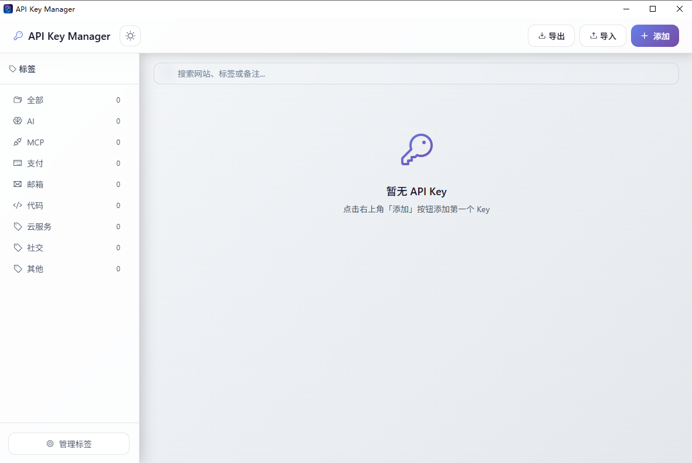
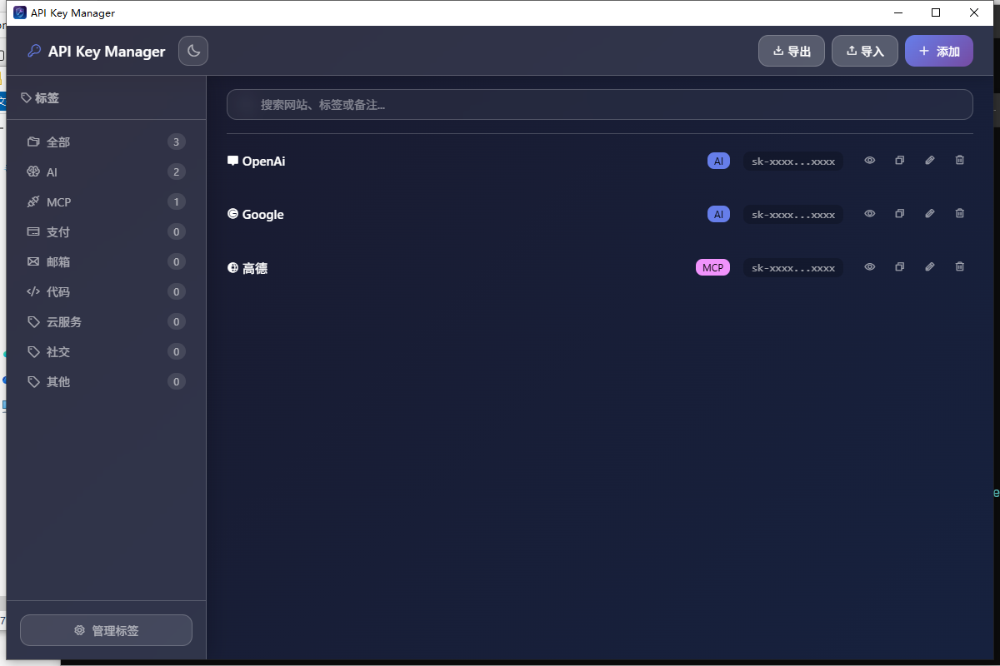
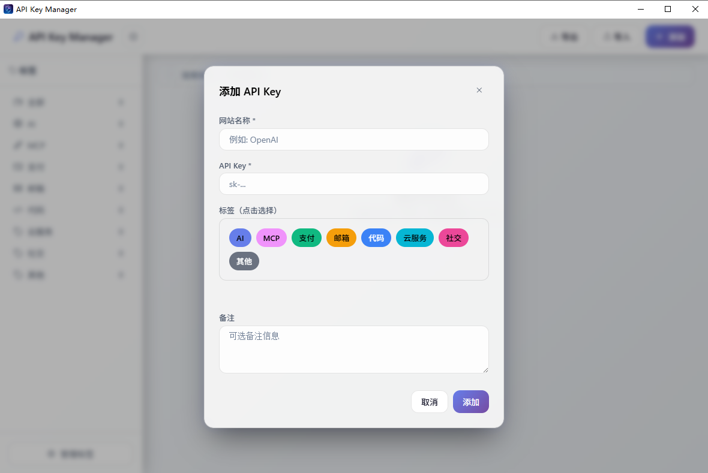
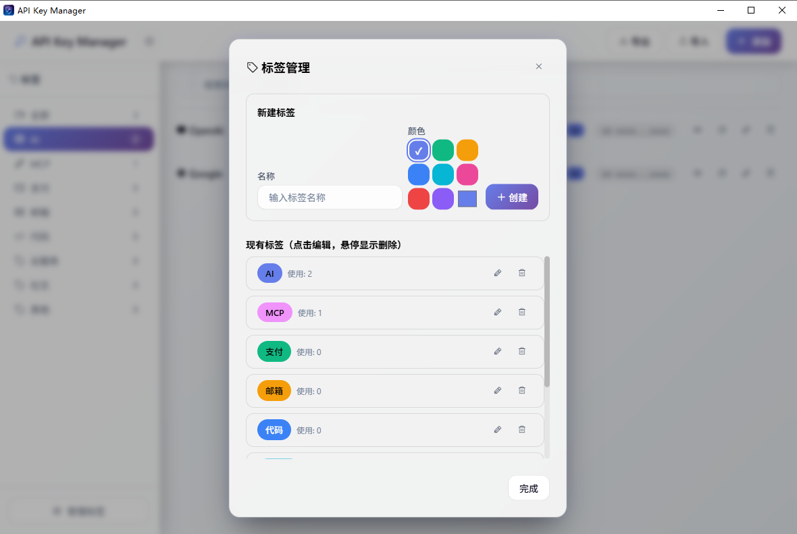
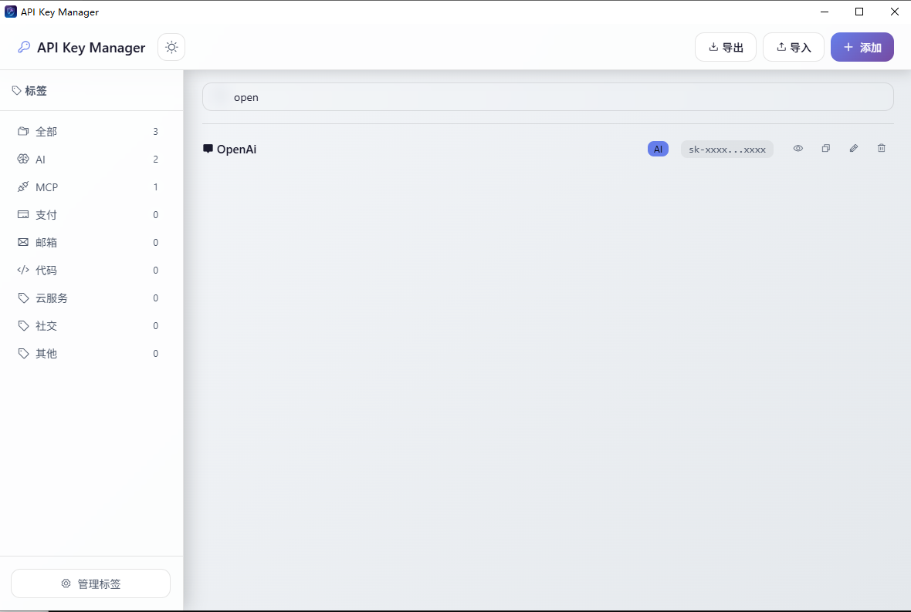
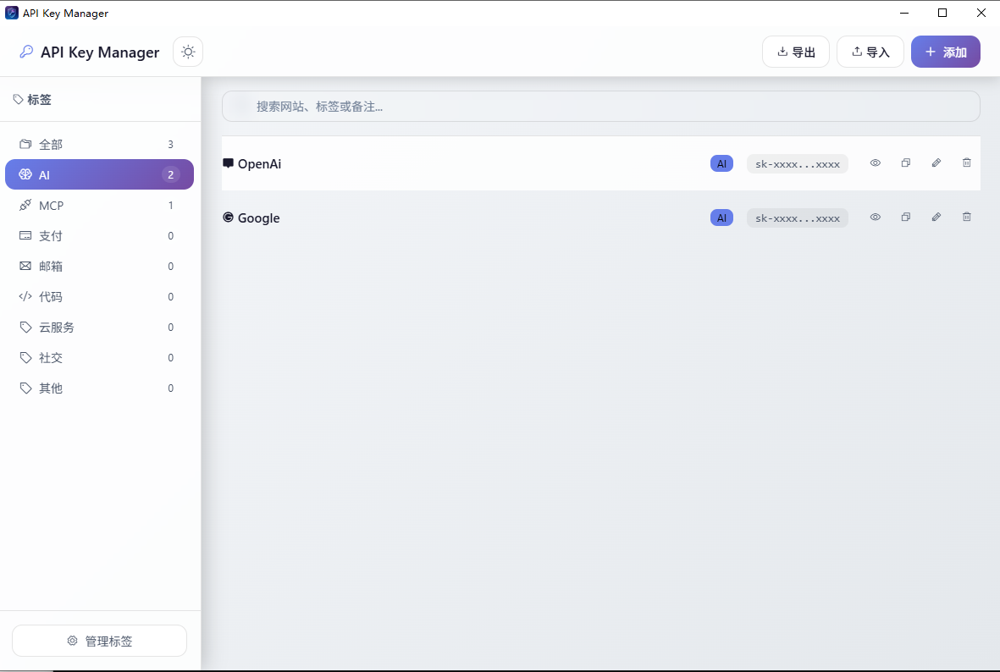

<div align="center">


</div>

<p align="center">
  
  
  
  
  
</p>

<p align="center">
  
</p>

---

> 一款安全、易用的桌面应用，帮助您本地加密存储和管理各种 API 密钥。
> 所有数据采用 AES-256-GCM 加密，完全离线运行，无需担心云端泄露。


## ✨ 核心特性

<table>
<tr>
<td width="50%" valign="top">

### 🔐 安全加密
- **AES-256-GCM** 军用级加密算法
- **SHA-256** 校验和防篡改
- 本地存储，数据不上云

</td>
<td width="50%" valign="top">

### 🏷️ 标签管理
- 预设 8 种常用标签
- 自定义标签颜色
- 快速筛选与搜索

</td>
</tr>
<tr>
<td width="50%" valign="top">

### 🎨 现代界面
- Glassmorphism 玻璃态设计
- 浅色/深色主题一键切换
- 本地化 Phosphor Icons

</td>
<td width="50%" valign="top">

### 📦 数据迁移
- 一键导出为 ZIP 压缩包
- 智能冲突检测与解决
- 导入前自动备份

</td>
</tr>
</table>


## 📸 界面预览

<p align="center">
  
  
</p>

<p align="center">
  
  
</p>

<p align="center">
  
  
</p>


## 🚀 快速开始

### 系统要求

- **Windows**: Windows 10+ (64位)，需安装 WebView2 运行时
- **Linux**: 主流发行版，需安装 WebKit2GTK

### 安装方式

从 [Releases](https://github.com/xsyl06/api-key-manager/releases) 下载对应平台的安装包：

| 平台 | 文件 |
|------|------|
| Windows | `api-key-manager-vX.X.X-windows-amd64.zip` |
| Linux | `api-key-manager-vX.X.X-linux-amd64.tar.gz` |

解压后直接运行即可，无需安装。

### 从源码构建

```bash
# 克隆仓库
git clone https://github.com/xsyl06/api-key-manager.git
cd api-key-manager

# 安装前端依赖
cd frontend && npm install && cd ..

# 开发模式运行
wails dev

# 构建生产版本
wails build -trimpath
```


## 📁 项目结构

```
📦 api-key-manager
├── 📂 internal/
│   ├── 📂 crypto/        # AES-256-GCM 加密模块
│   ├── 📂 models/        # 数据模型与错误定义
│   ├── 📂 services/      # 业务逻辑层 (Key/Tag)
│   └── 📂 storage/       # 文件存储与校验
├── 📂 frontend/
│   ├── 📂 src/           # Vanilla JS 模块
│   ├── 📂 styles/        # CSS 样式 (Glassmorphism)
│   └── 📂 public/        # 本地化图标字体
├── 📂 build/             # 构建配置与图标
├── 📂 docs/              # 文档与截图
├── 📄 main.go            # 应用入口
├── 📄 app.go             # Wails 绑定层
└── 📄 wails.json         # Wails 配置
```


## 🔒 安全机制

```
┌─────────────┐     ┌─────────────┐     ┌─────────────┐
│  用户输入    │────▶│ AES-256-GCM │────▶│  加密存储    │
│  API Key    │     │   加密引擎   │     │  data.json  │
└─────────────┘     └─────────────┘     └─────────────┘
                           │
                           ▼
                    ┌─────────────┐
                    │  master.key │
                    │  (32 bytes) │
                    └─────────────┘
                           │
                           ▼
                    ┌─────────────┐
                    │  SHA-256    │
                    │  校验和验证  │
                    └─────────────┘
```

- **加密密钥**: 自动生成 32 字节主密钥，存储于 `master.key`
- **数据完整性**: 每个文件附带 SHA-256 校验和，防止篡改
- **备份提醒**: 请定期备份 `data/` 目录，丢失 `master.key` 将无法解密


## 🤖 开发说明

> **本项目由 AI (Claude Code) 全程开发** —— 从架构设计到代码实现，从调试优化到文档撰写，均由 AI 与人类协作完成。

### 技术栈

| 层级 | 技术 |
|------|------|
| 后端 | Go 1.23 + Wails v2.11.0 |
| 前端 | Vanilla JS + Vite |
| 样式 | CSS (Glassmorphism) |
| 图标 | Phosphor Icons (本地化) |
| 加密 | AES-256-GCM + SHA-256 |

### 开发命令

```bash
# 开发模式 (热重载)
wails dev

# 构建生产版本
wails build -trimpath

# 清理构建
wails build -clean
```


## 📄 许可证

本项目采用 [MIT](./LICENSE) 许可证开源。

<div align="center">


**Built with ❤️ by AI + Human**

</div>